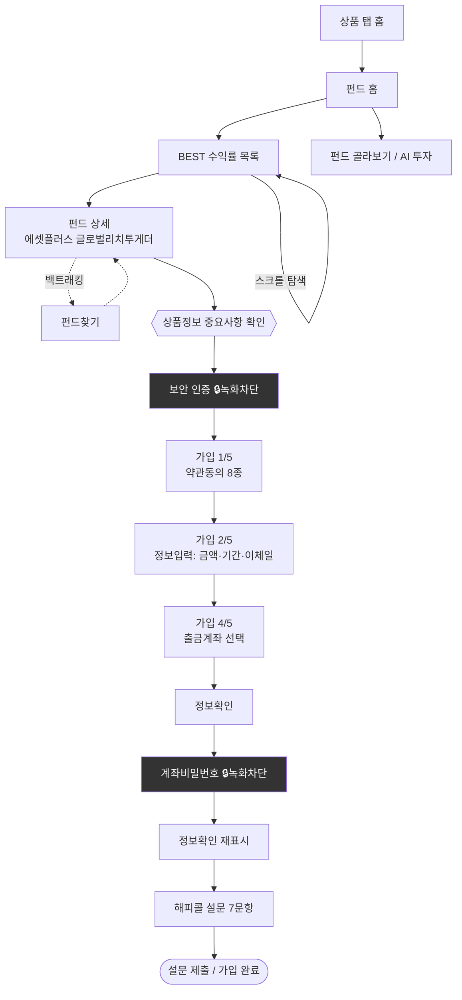

# 예시 영상 분석 데모 리포트

> **목적**: 기능 명세서(User Flow Analyzer)의 파이프라인이 실제로 어떤 산출물을 내는지, 업로드된 예시 영상으로 시연한 결과물.
>
> **분석 대상**: Screen_Recording_20260611_134957.mp4 (1080×2340, 3분 9초, 34fps)
> **처리 내역**: 장면 전환 감지 34개 + 2초 간격 샘플링 94프레임 → 키프레임 분석 (명세서 F-02~F-06 파이프라인 수동 시연)

---

## 요약

**하나원큐(하나은행) 앱 — 펀드 탐색 후 가입 완료까지의 전체 여정** (3분 9초)

| 지표 | 값 |
|---|---|
| 고유 화면 수 | 14개 |
| 단계(화면 전환) 수 | 약 30회 |
| 탐색 구간 | 0:00–1:30 (전체의 48%) |
| 가입 구간 | 1:32–3:09 (5단계 프로세스 + 해피콜 설문) |
| 녹화 차단(검은 화면) 구간 | 2회 (보안 입력 구간) |
| 민감정보 노출 | 계좌번호·잔액 노출 확인 → 마스킹 기능 필요성 입증 |

---

## 1. 화면 인벤토리 (14개 고유 화면)

| # | 화면명 | 유형 | 등장 구간 | 주요 요소 |
|---|---|---|---|---|
| S01 | 상품 탭 홈 | 허브 | 0:00 | "모두 다 하나통장" 배너, ETF신탁/모임통장/금리우대 카드, 상품검색, 하단 5탭(홈·자산·상품·투자·메뉴) |
| S02 | 펀드 홈 | 허브 | 0:02–0:14 | "차곡차곡 목돈 만들기" 배너, MY현황/시황구독/기초가이드, 펀드검색, BEST 수익률·판매량 탭 |
| S03 | BEST 수익률 목록 | 목록 | 0:04–0:30 | 펀드 카드(위험등급 뱃지, 기간수익률, 보유 TOP10 포트폴리오 표) |
| S04 | 펀드 골라보기/AI 투자 | 메뉴 | 0:12 | 인기별/연금저축/국민성장펀드, AI 포트폴리오 투자 — 로딩 스피너 관찰 |
| S05 | 펀드 상세 | 상세 | 0:34–1:24 | 에셋플러스글로벌리치투게더증권자투자신탁1호(주식)Ce, 주식형/글로벌/장마감 17:00, 보수·수수료(총보수 연 1.585%), 기간수익률 차트(1·3·6·12개월 탭), 펀드 선물하기/상품정보 확인하기 CTA |
| S06 | 펀드찾기 | 메뉴 | 1:06 | 인기/상품/테마 필터, AI 펀드랭킹, ELF, 해외뮤추얼 |
| S07 | 상품정보 중요사항 확인 | 바텀시트 | 1:24 | 금소법 고지 + "확인했습니다" |
| S08 | 보안 인증 (녹화 차단) | 보안 | 1:28–1:30 | 검은 화면 — OS 캡처 차단 |
| S09 | 펀드 가입 1/5 약관동의 | 폼 | 1:32–1:50 | 필수 약관 8종 전체동의, 투자설명서 문서 뷰어, 투자자 확인사항 안내 |
| S10 | 펀드 가입 2/5 정보입력 | 폼 | 1:54–2:30 | 적립식, 가입금액 키패드(10,000원), 가입기간 피커(기본 36개월 → 12개월로 변경), 자동이체일 키패드 |
| S11 | 펀드 가입 4/5 출금계좌 | 폼 | 2:36 | 머니박스통장 선택, 계좌번호·출금가능금액 표시 ⚠️민감정보 |
| S12 | 정보확인 | 확인 | 2:46, 3:00 | 가입금액/기간/자동이체/과세/보수 요약 |
| S13 | 계좌비밀번호 입력 (녹화 차단) | 보안 | 2:50–2:56 | 검은 화면 |
| S14 | 해피콜 설문 | 설문 | 3:02–3:09 | 7문항 예/아니요 (원금손실 인지, 자발적 가입 확인 등) → 설문 제출 |

캡처 원본: `key/` 폴더(고해상도 20장), `sheet0~3.png`(2초 간격 전체 타임라인)

---

## 2. 화면 흐름도

---

## 3. 단계별 행동 로그 (47개 이벤트 중 주요 발췌)

| 시각 | 화면 | 행동 | 비고 |
|---|---|---|---|
| 0:00 | 상품 탭 홈 | (시작) | |
| 0:02 | 펀드 홈 | 진입 탭 | |
| 0:04–0:10 | BEST 수익률 목록 | 스크롤 ×4 | 펀드 카드 비교 탐색 |
| 0:12 | 펀드 골라보기 | 스크롤, 로딩 대기 | 스피너 노출 |
| 0:16–0:30 | BEST 목록 | 스크롤 ×6 | 포트폴리오 표 확인 |
| 0:34 | 펀드 상세 | 펀드 카드 탭 | 에셋플러스글로벌리치투게더 |
| 0:36–1:04 | 펀드 상세 | 스크롤 + 수익률 기간 탭 전환(3↔6개월) | 보수·차트 확인 |
| 1:06 | 펀드찾기 | 이동 | **백트래킹**: 상세→찾기→상세 복귀 |
| 1:16 | 펀드 상세 | 복귀 | |
| 1:24 | 중요사항 확인 시트 | "확인했습니다" 탭 | |
| 1:28 | 보안 인증 | (녹화 차단) | 추정: 간편비밀번호 |
| 1:32 | 가입 1/5 약관동의 | 전체동의 탭 | 필수 8종 일괄 |
| 1:40 | 투자설명서 뷰어 | 문서 열람 후 닫기 | |
| 1:48 | 투자자 확인사항 | 확인 탭 | |
| 1:54 | 가입 2/5 정보입력 | 진입 | 기본값: 36개월 |
| 2:14 | 가입금액 키패드 | 10,000원 입력, 확인 | |
| 2:18–2:28 | 가입기간 피커 | **36개월→12개월 스크롤 변경 (~10초)** | |
| 2:32 | 자동이체일 키패드 | 11일 입력 | |
| 2:36 | 가입 4/5 출금계좌 | 머니박스통장 선택 | ⚠️계좌번호·잔액 노출 |
| 2:38–2:44 | 사후관리 서비스 질문 | 예/아니요 선택 | |
| 2:46 | 정보확인 | 내용 확인, 확인 탭 | |
| 2:50–2:56 | 계좌비밀번호 | (녹화 차단) | |
| 3:00 | 정보확인 | 재확인 | |
| 3:02–3:09 | 해피콜 설문 | 7문항 응답, 설문 제출 탭 | 종료 |

---

## 4. UX 진단

| # | 심각도 | 발견 | 근거 | 제안 |
|---|---|---|---|---|
| D1 | **High** | 가입 완료까지 체감 확인 단계 12+회 (약관 8종 + 중요사항 + 투자자 확인 + 정보확인 2회 + 설문 7문항) | 1:24–3:09, 가입 구간만 97초 | 금소법 필수 항목은 유지하되, 설문·확인 화면 통합 및 진행률 표시 강화 검토 |
| D2 | Mid | 가입기간 기본값 36개월 — 사용자가 12개월로 바꾸는 데 피커 스크롤 ~10초 소요 | 2:18–2:28 | 자주 선택되는 기간(12/24/36) 퀵버튼 제공 |
| D3 | Mid | 탐색 구간에 백트래킹 1회 (상세→펀드찾기→동일 상세 복귀) | 1:06–1:16 | 상세 화면 내 유사 펀드 비교 기능으로 이탈 없는 탐색 지원 |
| D4 | Mid | 가입 직후 해피콜 설문 7문항 — 완료 직전 이탈 위험 구간 | 3:02– | 문항 축약 또는 완료 후 푸시로 분리 가능 여부 법규 검토 |
| D5 | Low | 펀드 골라보기 진입 시 로딩 스피너 노출 | 0:12 | 스켈레톤 UI 검토 |
| ⚠️ | — | **민감정보 노출**: 계좌번호, 출금가능금액 290,001원이 프레임에 평문 노출 | 2:36, 2:46 | 도구의 자동 마스킹(F-09) 기본 ON 필요성 실증 |

*한계 고지: 단일 영상(n=1) 기반 진단으로, 일반화에는 추가 표본 필요.*

---

## 5. 도구 설계에 반영할 교훈 (이번 시연에서 확인된 것)

1. **녹화 차단(검은 화면) 구간 처리** — 금융앱은 비밀번호 등 보안 화면이 OS 차원에서 캡처 차단됨. 파이프라인에 "보안 구간" 자동 감지·라벨링 단계 추가 필요 (명세서 F-04에 반영 권장)
2. **터치 포인터 미표시** — 이 영상은 탭 위치 표시가 없어 행동을 화면 변화로만 추론. 녹화 가이드(개발자옵션 탭 표시 ON) 제공 시 정확도 상승
3. **동적 배너로 인한 동일 화면 오분리 위험** — 펀드 홈의 롤링 배너(1/4, 3/3)가 프레임마다 달라짐 → 클러스터링 시 배너 영역 가중치 축소 필요
4. **민감정보 마스킹은 선택이 아닌 필수** — 실제 계좌번호·잔액이 그대로 노출됨
